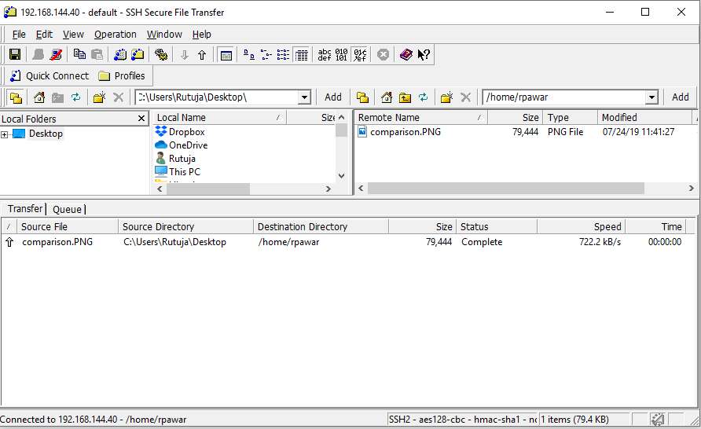
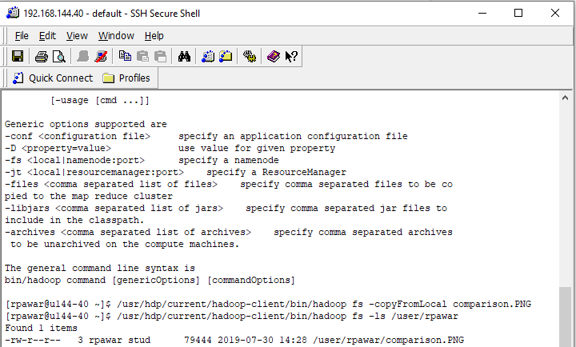

# Running the project


## Requirements

* [Java SE 1.8 JDK](https://www.oracle.com/technetwork/java/javase/downloads/jdk8-downloads-2133151.html)
* IDE: [IntelliJ](https://www.jetbrains.com/idea/download/#section=windows) or [Eclipse](https://www.eclipse.org/downloads/) (IMO IntelliJ is better)
* [Git](https://git-scm.com/downloads)


## Setup Steps

1. Make sure you have all the requirements installed

2. Clone the project on your local machine by executing the following command:
    ```
    git clone https://github.com/frozencure/aggressive-data-skipping.git
    ```

3. Import the project into your IDE ([Guide for IntelliJ](https://www.jetbrains.com/help/idea/gradle.html#gradle_import_project_start))

4. Build the project in order to download the requiered dependencies (Spark, Spring Boot etc). You can either do this from your IDE or by running the following command in the main project folder:
    ```
    ./gradlew build
    ```

5. Download the [Hadoop Binaries](https://github.com/srccodes/hadoop-common-2.2.0-bin/archive/master.zip) and store the file somewhere on your system. Update the `hadoop.winutils.path` found in `src/main/resources/application.properties` to point to the binaries. 

    For example, if the binary file is stored in `C:/Program Files/hadoop/bin/winutils.exe` the property should be `hadoop.winutils.path=C:/Program Files/hadoop`

6. Run the application, it should run without any errors on the `localhost:8080` port.

7. To test it, you can just go to your browser and try this link: `http://localhost:8080/calculator/multiply?n=3&n=2&n=5`. You should see an output of `30` in your browser.


# Connecting to the hadoop cluster

## Requirements

* [OpenVPN](https://openvpn.net/community-downloads/)

* [SSH Secure Shell Client and File transfer](https://www.ohlone.edu/download-and-install-ssh-secure-shell-secure-file-transfer-client-windows-web-center)

## Steps

1. Download and install OpenVPN

2. Copy the following files into `C:\Program Files\OpenVPN\config` or wherever OpenVPN is installed:
    * `verghele-2019.key`
    * `verghele-2019.crt`
    * `ca.crt`
    * `client-verghele-stud.conf`

3. If you are on Windows change the `client-verghele-stud.conf` to `client-verghele-stud.ovpn`

4. Start OpenVPN Gui and it should appear in your system tray. Right-click it and press `Connect`.

5. After isntalling the File Transfer and Shell clients, you connect to cluster by opening them and clicking `Quick Connect` with the following inputs:
    * Host: `192.168.144.40`
    * login: `username`/`password`

## Accessing Ambari UI

1. Make sure you performed the steps from the [Connecting to the hadoop cluster](#Connecting-to-the-hadoop-cluster) section.

2. Append in host file: `C:\Windows\System32\drivers\etc\hosts`
    ```
    192.168.144.41 u144-41.db.iti.internal u144-41
    192.168.144.42 u144-42.db.iti.internal u144-42
    192.168.144.43 u144-43.db.iti.internal u144-43
    192.168.144.44 u144-44.db.iti.internal u144-44
    192.168.144.45 u144-45.db.iti.internal u144-45
    192.168.144.46 u144-46.db.iti.internal u144-46
    192.168.144.47 u144-47.db.iti.internal u144-47
    192.168.144.48 u144-48.db.iti.internal u144-48
    192.168.144.49 u144-49.db.iti.internal u144-49
    192.168.144.40 u144-40.db.iti.internal u144-40
    ```
3. Access Ambari UI at `http://192.168.144.42:8080`


## Transfering files to cluster

1. Make sure you performed the steps from the [Connecting to the hadoop cluster](#Connecting-to-the-hadoop-cluster) section.

2. Drag and drop files using SSH File transfer client from local to the host directory:

    

3. Now transfer from host to the hdfs directory using SSH Secure Shell Client

    ```
    /usr/hdp/current/hadoop-client/bin/hadoop fs -copyFromLocal comparison.PNG

    /usr/hdp/current/hadoop-client/bin/hadoop fs -ls /user/verghele
    ```
    

## Running Spark job on cluster

1. Make sure you performed the steps from the [Connecting to the hadoop cluster](#Connecting-to-the-hadoop-cluster) section.

2. Run the following command (example):
    ```
    spark-submit --class spark.Classifier --master local word-count-0.1-SNAPSHOT.jar
    ```

* To see which Spark version is used:
    ```
    spark-submit --version
    ```

* To change Spark version for app:
    ```
    export SPARK_MAJOR_VERSION=2
    ```
* Check contents on HDFS:

    ```
    hadoop fs -ls
    ```


